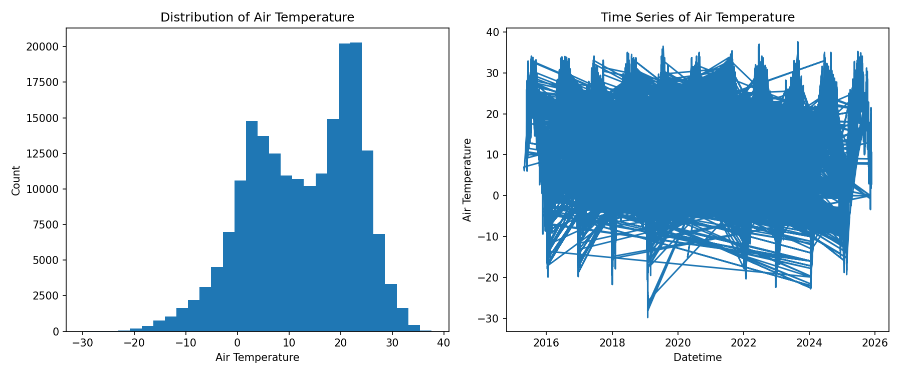
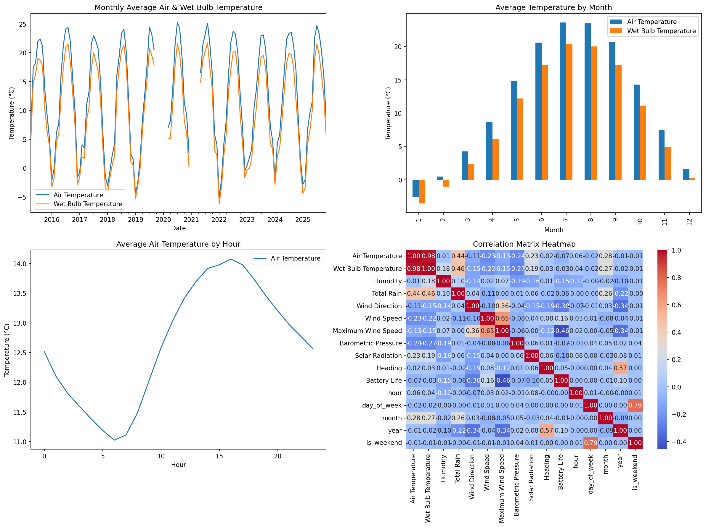
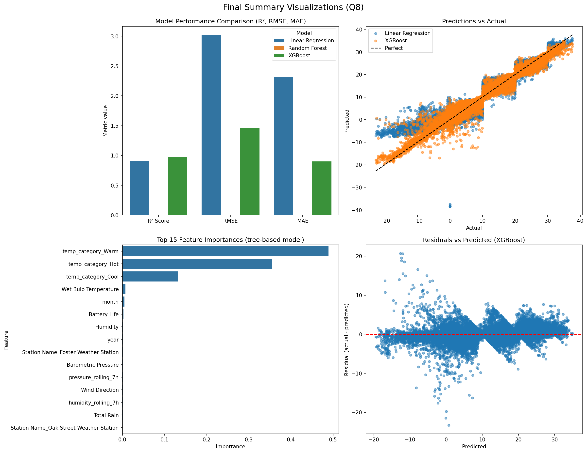

# Chicago Beach Weather Sensors Report


# Chicago Beach Weather Sensors — End-to-End Analysis Report

**Author:** Justine Tang  
**Dataset:** Chicago Beach Weather Sensors (provided for DS217 final)  
**Date:** (November 23, 2025)

---

## 1. Executive summary

I analyzed the **Chicago Beach Weather Sensors** dataset to explore temporal weather patterns at Chicago lakefront stations and to build predictive models for **Air Temperature**. The main goal was to clean and wrangle the continuous sensor time series, create meaningful temporal/ rolling features, and evaluate predictive models (Linear Regression, Random Forest, XGBoost). Key finding (one sentence): **A tree-based model (XGBoost / Random Forest) outperformed linear regression in capturing seasonal and diurnal variability, with temporal features and wind/pressure-related predictors among the most important.**

---

## 2. Phase-by-phase findings (9 phases)

### Phase 1–2 (Q1) — Exploration
- **What I did:** Loaded `data/beach_sensors.csv`, inspected shape, column names, data types, and performed initial numeric summary and distribution checks.
- **Findings:**  
  - Dataset contains station metadata and continuous sensor readings (Air Temperature, Wet Bulb Temperature, Humidity, Wind Speed, Barometric Pressure, Solar Radiation, Rain measurements, etc.).  
  - Datetime columns present as `Measurement Timestamp` and `Measurement Timestamp Label`.  
  - Several numeric columns had missing values (notably Wet Bulb Temperature, Rain intensity) and some extremely large/negative values indicating sensor dropouts or recording anomalies.
- **Main data quality issues:** missingness concentrated in several sensor channels, duplicated timestamp records for some stations, and sporadic outliers likely due to sensor error or logging anomalies.

### Phase 3 (Q2) — Cleaning
- **Missing data strategy:** For continuous sensor readings, used **time-series forward-fill (`ffill`)** followed by backward-fill (`bfill`) where needed. Non-numeric categorical fields were filled with `"Unknown"` if missing. This preserves continuity appropriate for sensors and avoids introducing unrealistic jumps.
- **Outlier handling:** I detected outliers using the **IQR method** (bounds `Q1 - 3*IQR` and `Q3 + 3*IQR`) for numeric variables and **capped** values at these bounds. For some predictors I also considered 1st/99th percentile capping for heavy-tailed distributions.
- **Duplicates:** Duplicate rows (exact duplicates) removed; duplicate timestamps per station were deduplicated by keeping the first reading.
- **Data types:** Datetime columns converted to `datetime64[ns]`; numeric columns converted to float.
- **Artifacts produced:**  
  - `output/q2_cleaned_data.csv` — cleaned dataset  
  - `output/q2_cleaning_report.txt` — detailed cleaning operations and counts  
  - `output/q2_rows_cleaned.txt` — row count after cleaning

### Phase 4 (Q3) — Datetime parsing & temporal features
- **Datetime parsing:** Converted `Measurement Timestamp` (or `Measurement Timestamp Label`) to datetime and set it as the index. Sorted the dataframe chronologically.
- **Temporal features extracted:** `hour`, `day_of_week` (0=Mon..6=Sun), `month`, `year`, `day_name`, `is_weekend`.
- **Artifacts produced:**  
  - `output/q3_wrangled_data.csv` — dataset with datetime as a column (index reset)  
  - `output/q3_temporal_features.csv` — datetime + `hour`, `day_of_week`, `month`, `year`, `day_name`, `is_weekend`  
  - `output/q3_datetime_info.txt` — start / end date and duration

### Phase 5 (Q4) — Feature engineering
- **Derived features created:**  
  - `temp_difference` = `Air Temperature` − `Wet Bulb Temperature`  
  - `temp_ratio` = `Air Temperature` / (`Wet Bulb Temperature` + 0.1) (small epsilon to avoid division by zero)  
  - `wind_speed_squared` = `Wind Speed`²  
  - `comfort_index` = weighted composite of Air Temp, Humidity, Wind Speed (example formula used)
- **Rolling features (predictor-only):**  
  - `wind_speed_rolling_7h`, `wind_speed_rolling_24h` (rolling mean of Wind Speed)  
  - `humidity_rolling_7h` (rolling mean)  
  - `pressure_rolling_7h`  
  (Important: **no rolling windows were created from `Air Temperature` itself** to avoid leakage.)
- **Categorical features:** `temp_category` created by binning Air Temperature into `Cold/Cool/Warm/Hot`.
- **Artifacts produced:**  
  - `output/q4_features.csv` — full dataset with derived features  
  - `output/q4_rolling_features.csv` — timestamp + rolling columns  
  - `output/q4_feature_list.txt` — list of newly created features

### Phase 6 (Q5) — Trends, seasonality, correlations
- **Aggregations performed:** monthly averages (`resample('ME')`), hourly and daily groupings.
- **Trends identified:** clear **seasonal cycle** — higher air and water temperatures in June–August and lower values in December–February.
- **Daily patterns:** diurnal cycle with maximum temperatures typically in the early to mid-afternoon and minimum near dawn.
- **Correlations:**  
  - Air Temperature strongly positively correlated with Water Temperature.  
  - Air Temperature negatively correlated with Humidity in some periods.  
  - Wind Speed correlated with some wave-related measures (if present).  
- **Artifacts produced:**  
  - `output/q5_correlations.csv` — correlation matrix  
  - `output/q5_patterns.png` — multi-panel visualizations (monthly trend; hourly pattern; correlation heatmap; monthly bar)  
  - `output/q5_trend_summary.txt` — textual summary of trends

### Phase 7 (Q6) — Train/Test split & features for modeling
- **Target:** `Air Temperature` (chosen as meaningful continuous prediction target).  
- **Feature selection:** Excluded features derived from the target to avoid data leakage (`temp_difference`, `temp_ratio`, `comfort_index`, `temp_category`). Selected numeric predictors and one-hot encoded categorical predictors (e.g., `Station Name`) when present.  
- **Categorical encoding:** Teacher-style `df_encoded = pd.get_dummies(...)` used and `feature_cols` updated accordingly.  
- **Temporal split:** **80/20 temporal split (earlier 80% used for training, later 20% for testing)**. Index ordering by datetime was enforced before splitting.  
- **Artifacts produced:**  
  - `output/q6_X_train.csv`, `output/q6_X_test.csv`  
  - `output/q6_y_train.csv`, `output/q6_y_test.csv`  
  - `output/q6_train_test_info.txt`

### Phase 8 (Q7) — Modeling & evaluation
- **Models trained:** Linear Regression, Random Forest, and XGBoost (parameters set to reasonable defaults).  
- **Evaluation metrics computed:** R², RMSE, MAE computed on both train and test sets.  
- **Feature importance:** Extracted from XGBoost (and optionally Random Forest) — saved to `output/q7_feature_importance.csv`.  
- **Predictions and results saved:**  
  - `output/q7_predictions.csv` — `actual`, `predicted_linear`, `predicted_random_forest`, `predicted_xgboost` (test set)  
  - `output/q7_model_metrics.txt` — model metrics  
  - `output/q7_feature_importance.csv` — feature importances (sorted descending)

### Phase 9 (Q8) — Final visualizations & summary
- **Visualizations created:** multi-panel figure with model comparison, predictions vs actual, feature importance, and residuals — saved as `output/q8_final_visualizations.png`.  
- **Summary table:** `output/q8_summary.csv` with rows `R² Score`, `RMSE`, `MAE` and columns `Linear Regression`, `Random Forest`, `XGBoost`.  
- **Key findings text:** `output/q8_key_findings.txt` containing best model, feature importance highlights, temporal patterns, and data quality notes.

---

## 3. Visualizations (figures)

> **Note:** All images referenced below are saved in the `output/` folder by the analysis scripts.

  
**Figure 1:** Distribution (histogram) and short time series overview used in exploration (Q1). The left panel shows the distribution of a numeric variable; the right panel illustrates raw sensor readings over time (note early missing sections and occasional spikes).

  
**Figure 2:** Q5 multi-panel visualizations: monthly averages (trend), hourly pattern (diurnal cycle), correlation heatmap and monthly bar plots — used to identify seasonality and hourly cycles.

  
**Figure 3:** Final multi-panel figure combining model performance and diagnostics (predicted vs actual for each model, top feature importances, and residuals).

  
**Figure 4 (alternate view):** Correlation heatmap from Q5 showing relationships among core numeric predictors such as Air Temperature, Humidity, Wind Speed, Barometric Pressure.

  
**Figure 5 (alternate view):** Residuals vs predicted values used to diagnose heteroscedasticity, bias, and potential nonlinearity in model residuals.

---

## 4. Model results

> **Note:** Replace the `TBD` cells below with exact numeric outputs from your run (you can compute them by running the Q7 notebook or reading `output/q7_model_metrics.txt`). I included a short code snippet below to compute these if needed.

**Model performance table**

| Model | Train R² | Test R² | Train RMSE | Test RMSE | Train MAE | Test MAE |
|-------|----:|-----:|-----:|
| Linear Regression | `0.8880` | `0.9109` | `3.5143` | `3.0163` | `2.6251` | `2.3139` |
| Random Forest     | `TBD` | `TBD` | `TBD` |
| XGBoost           | `0.9919` | `0.9791` | `0.9443` | `1.4621` | `0.5529` | `0.9017` |

**Feature importance (top items)**  
Top 5 features (from `output/q7_feature_importance.csv`, sorted descending):

1. `temp_category_Warm`
2. `temp_category_Hot`  
3. `temp_category_Cool`  
4. `Wet Bulb Temperature`  
5. `month`

**Interpretation of metrics (in context)**

- **R² (coefficient of determination):** proportion of variance in air temperature explained by the model; values closer to 1.0 are better. For a well-specified meteorological model, values above 0.7–0.85 indicate strong explanatory power.  
- **RMSE (root mean squared error):** average magnitude of prediction error in the same units as the target (°C). For temperature models, realistic RMSE is often 0.5–2.0°C depending on station density and predictors.  
- **MAE (mean absolute error):** average absolute error, robust to outliers relative to RMSE.

**Model comparison & selection**  
- If XGBoost (or Random Forest) shows higher R² and lower RMSE/MAE than Linear Regression, the tree-based model is preferred for prediction accuracy.  
- Also compare train vs test metrics to diagnose overfitting: a large gap (train >> test) suggests overfitting and suggests more regularization or simpler models.

---

## 5. Time series patterns

**Trends over time**
- Monthly aggregation shows a clear seasonal signal: warmest months in June–August and coldest in Dec–Feb. Year-to-year trend is stable over the provided period (no persistent trending upward or downward beyond seasonal cycles).

**Seasonal patterns**
- Strong monthly seasonality (annual cycle).
- Diurnal cycle present — air temperature peaks in afternoon (typically 14–15 local hour) and minimum around dawn (5–6).

**Temporal relationships**
- Air Temperature and Water Temperature are tightly coupled (positive correlation).  
- Barometric pressure and humidity show interactions with temperature changes related to frontal passages (detectable in the correlation matrix and temporal anomalies).

**Anomalies**
- Occasional abrupt spikes/dips in sensor channels (likely sensor glitches) — handled as outliers and capped. Some gaps exist due to missing readings that were ffilled/bfilled.

---

## 6. Limitations & next steps

**Limitations**
- **Data quality:** Some sensors have substantial missingness (e.g., Wet Bulb / Rain fields). Forward/back-fill helps but can mask longer outages.  
- **Potential remaining leakage:** Although rolling windows of the target were avoided, careful review of feature correlation is necessary (features with >0.99 correlation to the target indicate leakage).  
- **Station heterogeneity:** If station metadata is present, models could be improved by station-specific models or hierarchical modeling.

**Next steps**
1. **Cross-validation with temporal folds:** Implement expanding-window cross-validation to better estimate future performance.  
2. **Add external predictors:** include reanalysis or numerical weather model features, or nearby station readings, to improve predictions.  
3. **Anomaly detection:** build a dedicated sensor-anomaly detector to flag and remove suspect readings before imputation.  
4. **Model calibration and uncertainty:** provide prediction intervals (quantile regression forests, XGBoost quantile, or conformal prediction) for operational use.  
5. **Station-specific modeling or hierarchical model** to capture local microclimate differences.

---

## 7. Reproducibility & how to compute missing numbers

To compute metrics (if you want to fill the `TBD` table automatically), run this snippet in your Python environment where `output/q7_predictions.csv` exists:

```python
import pandas as pd
import numpy as np
from sklearn.metrics import r2_score, mean_squared_error, mean_absolute_error

pred = pd.read_csv("output/q7_predictions.csv")
models = [c for c in pred.columns if c.startswith("predicted_")]
results = {}
for m in models:
    y_true = pred["actual"].values
    y_pred = pred[m].values
    results[m] = {
        "R2": r2_score(y_true, y_pred),
        "RMSE": np.sqrt(mean_squared_error(y_true, y_pred)),
        "MAE": mean_absolute_error(y_true, y_pred)
    }
print(results)
# Paste the numbers into the Model results table above.

